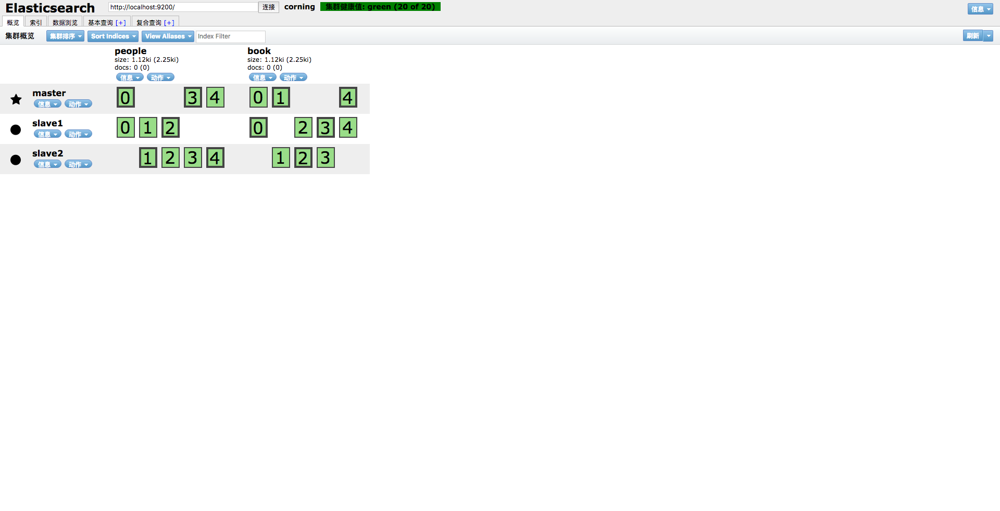

# 4-1 索引创建

## RESTFul API

* API基本格式
  http://<ip>:<port>/<索引>/<类型>/<文档id>

* 常用HTTP动词
  GET/PUT/POST/DELETE

## 创建索引

* 非结构化创建

* 结构化创建

## 创建结构化索引

### POST http://localhost:9200/book/novel/_mappings

* 请求
```json
{
  "novel": {
    "properties": {
      "title": {
        "type": "text"
      }
    }
  }
}
```
* 返回
```json
{
"acknowledged": true
}
```

## 懒得敲代码的，可以直接点击下面按钮～～

[](https://app.getpostman.com/run-collection/ddfd5917ee60af2cc714)


### PUT http://127.0.0.1:9200/people

* 请求

```json
{
  "mappings": {
    "man": {
      "properties": {
        "id": {
          "type": "long"
        },
        "name": {
          "type": "text"
        },
        "gender": {
          "type": "boolean"
        },
        "country":{
          "type": "text"
        },
        "age": {
          "type": "integer"
        },
        "date": {
          "type": "date",
          "format": "date_hour_minute_second_millis||date"
        }
      }
    }
  }
}
```

* 返回

```json
{
    "acknowledged": true,
    "shards_acknowledged": true,
    "index": "people"
}
```

## 检查结果

